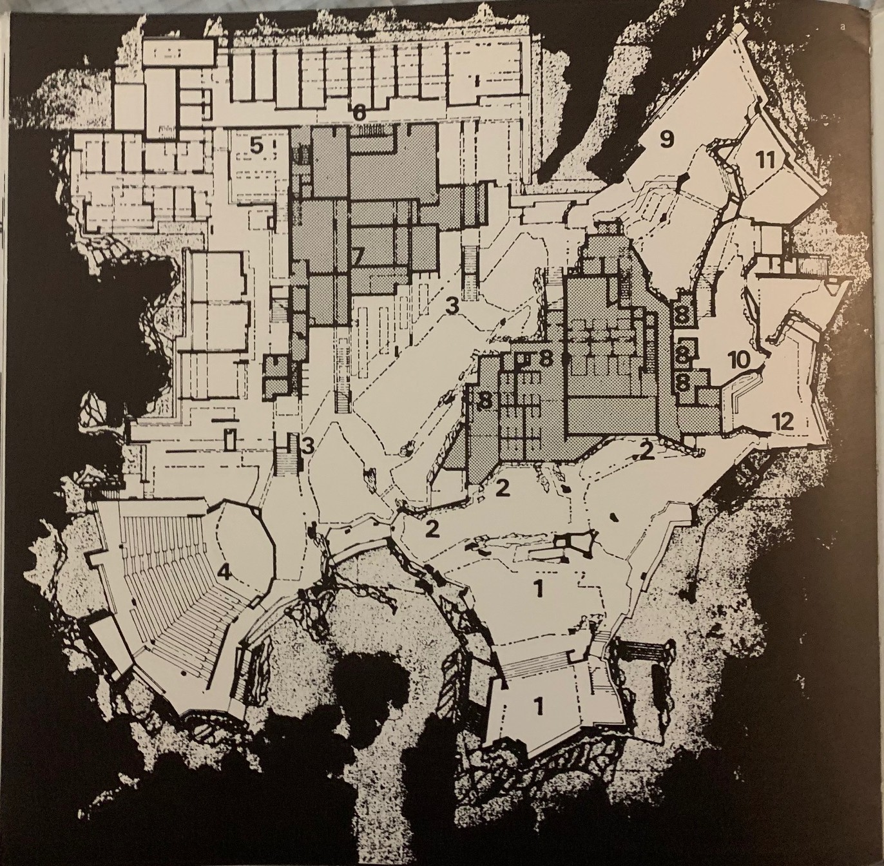
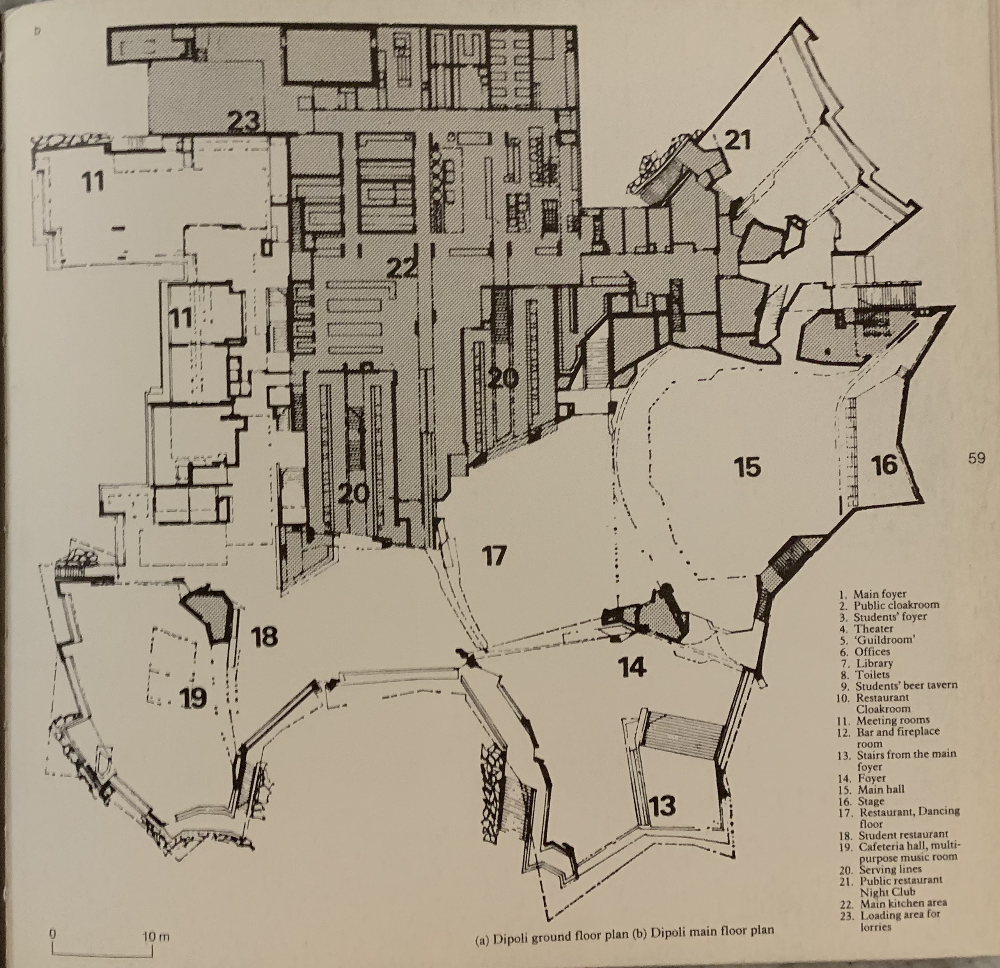
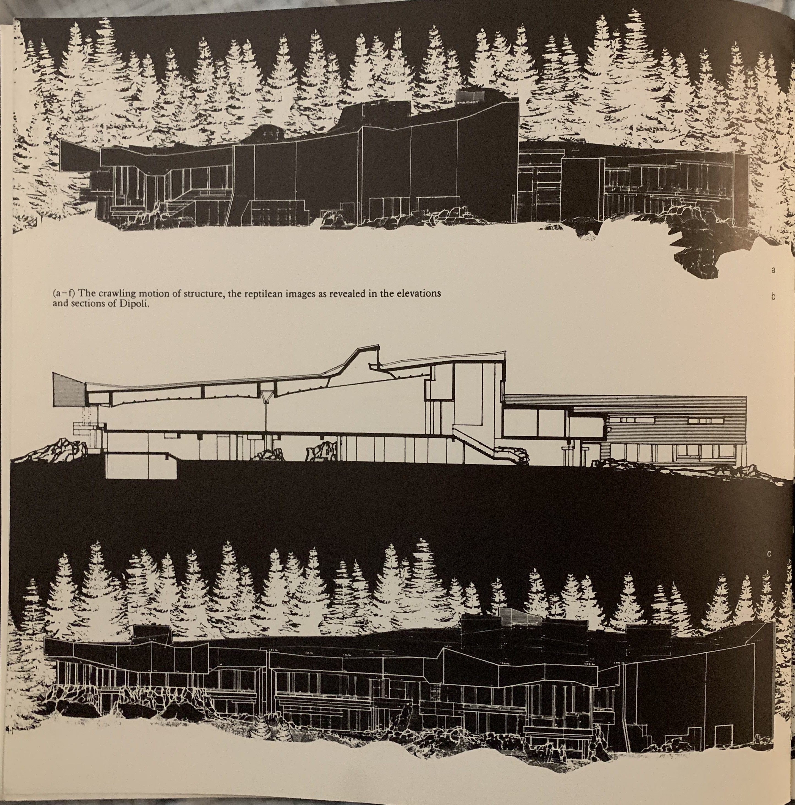
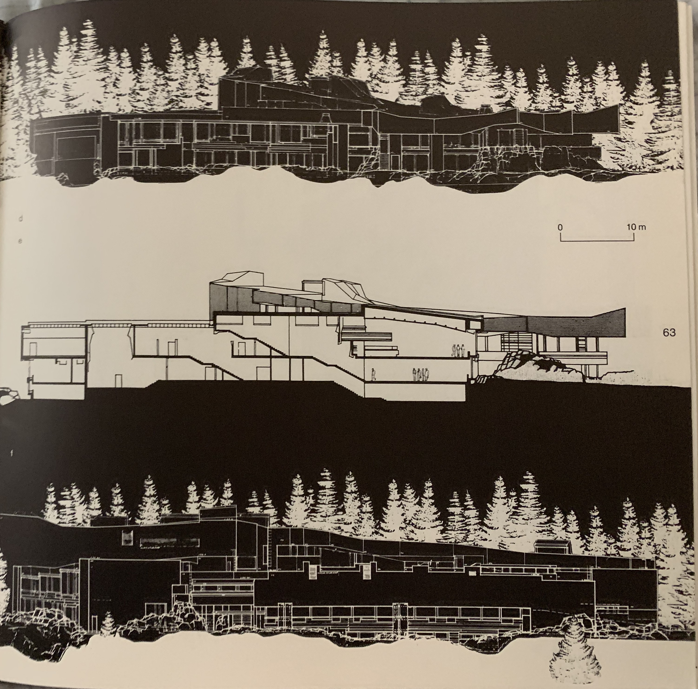
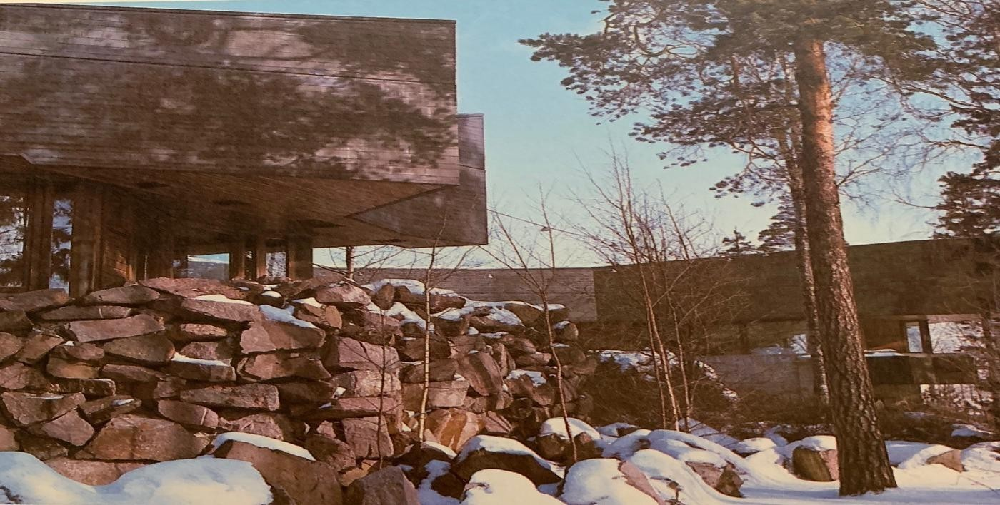

<!--- 
## Welcome to GitHub Pages

You can use the [editor on GitHub](https://github.com/tiramisueanne/DipoliBlog/edit/master/index.md) to maintain and preview the content for your website in Markdown files.

Whenever you commit to this repository, GitHub Pages will run [Jekyll](https://jekyllrb.com/) to rebuild the pages in your site, from the content in your Markdown files.

### Markdown

Markdown is a lightweight and easy-to-use syntax for styling your writing. It includes conventions for

```markdown
Syntax highlighted code block

# Header 1
## Header 2
### Header 3

- Bulleted
- List

1. Numbered
2. List

**Bold** and _Italic_ and `Code` text

[Link](url) and 
```

For more details see [GitHub Flavored Markdown](https://guides.github.com/features/mastering-markdown/).

### Jekyll Themes

Your Pages site will use the layout and styles from the Jekyll theme you have selected in your [repository settings](https://github.com/tiramisueanne/DipoliBlog/settings). The name of this theme is saved in the Jekyll `_config.yml` configuration file.

### Support or Contact


Having trouble with Pages? Check out our [documentation](https://help.github.com/categories/github-pages-basics/) or [contact support](https://github.com/contact) and we’ll help you sort it out. 
-->

# Dipole Dancer
### An exploration of the laws of attraction (and repulsion) that went into Dipoli at Espoo, Finland

## But what is it? 

The name Dipoli is a pun: it can mean "dipole", or "The second Poli", ("Dipoli") which would refer to the second building for the polytechnic students at Helsinki University of Technology. It was built in 1966 and designed by architects Reima and Raili Pietila (Rojas). 

“Dipoli.” _Venue_, Finnish Satellite Workshop 2019, 2019, spaceworkshop.fi/venue.html.

Rojas, Cristobal. “Dipoli - Aalto University Main Building / ALA Architects.” _ArchDaily_, VELUX, 4 Dec. 2017, www.archdaily.com/884666/dipoli-aalto-university-main-building-ala-architects.

## Okay, but **what is it?**

The University was a bit... ambitious. The actual design of Dipoli was submitted to a competition where no one won first place, due to no one quite matching the program that the University had wanted. To illustrate, the finished product allows for night entertainment, film screenings, dances, dinners, while serving as a dining hall in the winter and a conference center in the summer, and this was still not enough (Marquez). Thus, not only are college students going to see this place extremely regularly, but people from all over the world are going to visit the University with one of their only interactions with its architecture being Dipoli. Secondary users of the building are the people at Aalto University, who bought the building, who made the front entrance a public exhibition hall (University). This allows for Dipoli to become almost a University-Museum hybrid, heightening its intellectual prowess for the general public.  

Marquez, Moises Royo. _Pietila_ . 2014, oa.upm.es/33124/1/MOISES_ROYO_MARQUEZ_1.pdf.

University, Aalto. “Campus Tour Part 2 Väre and Dipoli – Student Vlogger Dasha.” YouTube, YouTube, 12 Nov. 2018, www.youtube.com/watch?v=6eTjx5ggHlg.

## What did the designs look like? 
   

We can see all of the complexity of the buildings functionality within the floorplans, and how the building works itself into its site in the elevations. Note especially the rock outcroppings underneath the building, much like the ones that decorate it. All pictures are from _Reima Pietilä: Architetcture, Context and Modernism_.

Quantrill, Malcolm. _Reima Pietilä: Architetcture, Context and Modernism_. Otava, 1985.

## What did the building look like? 



We can see the different types of building materials used here. The top, eye-catching overhang is made of copper, which once oxidized, will turn green. The mid-section is made of glass and wood, functioning as an articulated window. The base, which I think personally grabs attention the most, is made out of stone, much like the granite outcroppings that would have been in the area (Quantrill).

 (Quantrill)

Here we can see the details in the copper roof, which looks analogous to the logs of wood in the midsection of the building. 

We can see it in context from these Google Earth images


