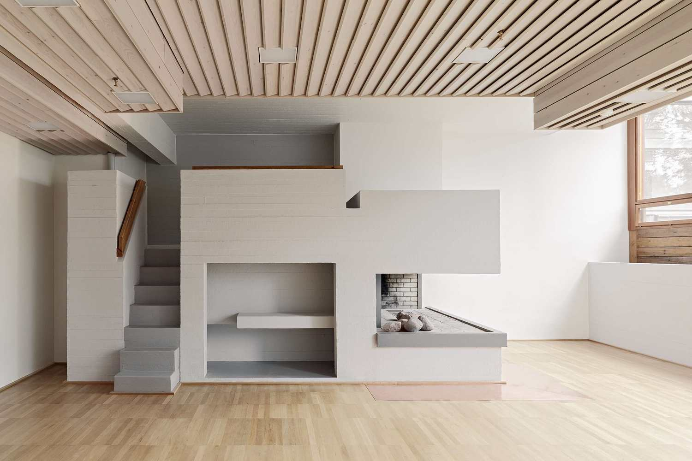

<!--- 
## Welcome to GitHub Pages

You can use the [editor on GitHub](https://github.com/tiramisueanne/DipoliBlog/edit/master/index.md) to maintain and preview the content for your website in Markdown files.

Whenever you commit to this repository, GitHub Pages will run [Jekyll](https://jekyllrb.com/) to rebuild the pages in your site, from the content in your Markdown files.

### Markdown

Markdown is a lightweight and easy-to-use syntax for styling your writing. It includes conventions for

```markdown
Syntax highlighted code block

# Header 1
## Header 2
### Header 3

- Bulleted
- List

1. Numbered
2. List

**Bold** and _Italic_ and `Code` text

[Link](url) and 
```

For more details see [GitHub Flavored Markdown](https://guides.github.com/features/mastering-markdown/).

### Jekyll Themes

Your Pages site will use the layout and styles from the Jekyll theme you have selected in your [repository settings](https://github.com/tiramisueanne/DipoliBlog/settings). The name of this theme is saved in the Jekyll `_config.yml` configuration file.

### Support or Contact


Having trouble with Pages? Check out our [documentation](https://help.github.com/categories/github-pages-basics/) or [contact support](https://github.com/contact) and we’ll help you sort it out. 
-->

# Dipole Dancer
### An exploration of the laws of attraction (and repulsion) that went into Dipoli at Espoo, Finland
### I chose a website and this theming due to the fact that originally, Dipoli was a building for a technical institute. 

## But what is it? 

The name Dipoli is a pun: it can mean "dipole", or "The second Poli", ("Dipoli") which would refer to the second building for the polytechnic students at Helsinki University of Technology. It was built in 1966 and designed by architects Reima and Raili Pietila (Rojas). 

“Dipoli.” _Venue_, Finnish Satellite Workshop 2019, 2019, spaceworkshop.fi/venue.html.

Rojas, Cristobal. “Dipoli - Aalto University Main Building / ALA Architects.” _ArchDaily_, VELUX, 4 Dec. 2017, www.archdaily.com/884666/dipoli-aalto-university-main-building-ala-architects.

## Okay, but **what is it?**

The University was a bit... ambitious. The actual design of Dipoli was submitted to a competition where no one won first place, due to no one quite matching the program that the University had wanted. To illustrate, the finished product allows for night entertainment, film screenings, dances, dinners, while serving as a dining hall in the winter and a conference center in the summer, and this was still not enough (Marquez). Thus, not only are college students going to see this place extremely regularly, but people from all over the world are going to visit the University with one of their only interactions with its architecture being Dipoli. Secondary users of the building are the people at Aalto University, who bought the building, who made the front entrance a public exhibition hall (University). This allows for Dipoli to become almost a University-Museum hybrid, heightening its intellectual prowess for the general public.  

Marquez, Moises Royo. _Pietila_ . 2014, oa.upm.es/33124/1/MOISES_ROYO_MARQUEZ_1.pdf.

University, Aalto. “Campus Tour Part 2 Väre and Dipoli – Student Vlogger Dasha.” YouTube, YouTube, 12 Nov. 2018, www.youtube.com/watch?v=6eTjx5ggHlg.

## What did the designs look like? 
   

We can see all of the complexity of the buildings functionality within the floorplans, and how the building works itself into its site in the elevations. Note especially the rock outcroppings underneath the building, much like the ones that decorate it. All pictures are from _Reima Pietilä: Architetcture, Context and Modernism_.

Quantrill, Malcolm. _Reima Pietilä: Architetcture, Context and Modernism_. Otava, 1985.

## What did the building look like? 

Rocks as a Facade
 (Quantrill)

We can see the different types of building materials used here. The top, eye-catching overhang is made of copper, which once oxidized, will turn green. The mid-section is made of glass and wood, functioning as an articulated window. The base, which I think personally grabs attention the most, is made out of stone, much like the granite outcroppings that would have been in the area (Quantrill).
Details Above
 (Quantrill)

Here we can see the details in the copper roof, which looks analogous to the logs of wood in the midsection of the building. 

 (Rojas)

This shot is of the front of the building, where we can see the kinetic sculpture, which can open and close like a flower. This metal flower oxymoron coincides with the same confusion of a building being part of the landscape, a motif that Dipoli illustrates.

 (Rojas)

I love this photo, because I believe that it illustrates Pietila's ability to understand that in nature, there would be something that would stand out, something that would catch your attention but still be part of the overall picture. This huge wall without window breaks looks like a jagged peak of a small mountain, exactly the rocky intonation that Dipoli gives off. 

We can see it in context from these Google Earth images, this one emphasizing the forest and greenery that surrounds the site,

 ("Google Earth")

and this one, which notes how close it is to the city of Helsinki and that, while in a forest, was in a heavily populous area. 

("Google Earth")


“Overview – Google Earth.” _Google Search_, Google, www.google.com/earth/.

Quantrill, Malcolm. _Reima Pietilä: Architetcture, Context and Modernism_. Otava, 1985.

Rojas, Cristobal. “Dipoli - Aalto University Main Building / ALA Architects.” _ArchDaily_, VELUX, 4 Dec. 2017, www.archdaily.com/884666/dipoli-aalto-university-main-building-ala-architects.


## What sources could I find in the library? 

The first book I found was _Reima Pietilä: Architetcture, Context and Modernism_, which serves as an encyclopedia of his works. The book first sets up the context of architecture in Finland in the prior decades, talking about how experimentation in modernism was becoming more acceptable. It has critiques of every building Pietila designed, and includes interjections and drawings from Pietila himself. 

The second book, _One Man's Odyssey in Search of Finnish Architecture_, is almost supplementary to the first: it is a documentation of the interaction and relationship between Quantrill and Pietila. It contains recounts of people's experiences with Pietila, the author's experiences, Pietila's philosophy, and other quirks. The book is a great resource for needing to know *why* Pietila designed. 

Quantrill, Malcolm. _Reima Pietilä: Architetcture, Context and Modernism_. Otava, 1985.

Pietilä Reima, and Malcolm Quantrill. Suomalaisen Arkkitehtuurin etsijä: Omistettu Reima Pietilälle = One Man's Odyssey in Search of Finnish Architecture. Rakennuskirja Oy, 1988.

## What can the other Academics teach us? 

While not in a journal, Marquez's doctoral thesis gives us a beautiful in-depth dive into Dipoli. Even though only a few segments are translated into English, I still learned many things. For instance, it was awful trying to figure out what the roof of the inside of the building was made out of, but the thesis explained the use of concrete for the effect of pulling the whole building together under one roof. He describes the relationship between the Reima and Raili on this project, and how this project is the first to have Raili flesh out Reima's initial ideas and keep things running. This thesis also introduced the concept that Dipoli has "never been completely defined as an architectural work." (pg 28) I am symphathetic to those who do not immediately classify it as architecutre, as Pietila himself questioned, "Is Dipoli not an early land art work?" (Quantrill, pg 56) 


Marquez, Moises Royo. _Pietila_ . 2014, oa.upm.es/33124/1/MOISES_ROYO_MARQUEZ_1.pdf.

Quantrill, Malcolm. _Reima Pietilä: Architetcture, Context and Modernism_. Otava, 1985.


## How would I represent it? 


## How did the inside look? Also, let's look at it a lot. 

Before we continue, there was a renovation only a few years ago, so if some of these style seem bizarrely modern, that's because they are. That being said, the inside really entranced me, and so I gathered quite a few pictures from ArchDaily.com. Please note how intensely different each room is, while still following the motifs required to keep everything seamless. 

Rocks Inside and Outside


Pietila was inspired by the rocks outcroppings that he saw when he visited the site, (Quantrill) and so he used them not only as a facade but as internal decoration. The effect is that the person is low into the ground, and still very connected to nature while inside a building.

Ridiculously Cozy


However, gigantic rocks along walls and walkways do not make for the most welcoming environment. That is where he executed an extraordinarily cozy design, which is well represented in this room. The roughly painted wood, with the human sized cubby-hole and the modern, yet immediately recognizable fire-place creates an area that feels like a Finnish hug on a cool day. 

Fine Dining
 

This is one of the areas most touched by the renovation, but I think the renovators did a stellar job. The wood details as well as the consistent motif of perfectly vertical or horizontal wooden or metal lines keeps it intact with the rest of the building. 

Still a Conference Center


It's easy to forget after seeing all of the previous rooms that Dipoli is still supposed to serve as a conference center over the summert. That means large rooms, and this one utilizes the order of the horizontal wood motif to make what a human would see in the periphery more professional. However, if you look up, as the man is doing, we see small holes permeating this bright white concrete ceiling (Marquez), giving us back organic light in what looks organic permeations.

The View


Because of the site, windows were big enough for a human to look up and see all of the surrounding greenery. This upper floor room looks out and immediately sees the leaves of the pine trees that surround the building, immediately adding an organic touch to the building. 

Marquez, Moises Royo. _Pietila_ . 2014, oa.upm.es/33124/1/MOISES_ROYO_MARQUEZ_1.pdf.

Quantrill, Malcolm. _Reima Pietilä: Architetcture, Context and Modernism_. Otava, 1985.

Rojas, Cristobal. “Dipoli - Aalto University Main Building / ALA Architects.” _ArchDaily_, VELUX, 4 Dec. 2017, www.archdaily.com/884666/dipoli-aalto-university-main-building-ala-architects.


## Not satisfied with still pictures?

[](https://www.youtube.com/watch?v=6eTjx5ggHlg) (University)

The second half of this video deals with Dipoli. Firstly, I had no idea that the sculpture that looked like an artichoke out front was *kinetic*. Secondly, Dipoli is the largest dining hall on campus, which means that students are going to be visiting there quite a bit. I also learned that the main entrance served as a public exhibition. 

University, Aalto. “Campus Tour Part 2 Väre and Dipoli – Student Vlogger Dasha.” YouTube, YouTube, 12 Nov. 2018, www.youtube.com/watch?v=6eTjx5ggHlg.

## How did Pietila feel about this building? 
There doesn't seemed to be any filmed or transcribed interviews directly about Dipoli, instead of Pietila's overarching style. So, I decided to go with quotes and paraphrased quotes from Quantrill's books. 

Quantrill, in his book, paraphrases Pietila beautifully, 
"To Pietila, the 'Dipoli' is a forest, of which the building is merely part. In this forest cotnext the external wall is not a barrier in the normal architectural sense, but a skin that adpats the building to fit the natural environment, to give the man-made structure a sense of place." (Quantrill, 56)

The organic nature and blending with the forest is paramount to both Pietila and to the finished work. Pietila is then directly quoted, "Dipoli is not a terrain building but a copper sculpture.. there are three sliding walls casually separating three other halls fo rmulti-purpose functions. This set of four halls is a cave sequence of 100 metres. I feel as though I'm standing inside the body of a huge animal!" (Quantrill, 55) This animalistic imagery again supports all of the organic nature of the building. The emphasis of the multi-functionality of the building probably relates back to his accomplishment of making such a hugely programmed building. 

The selection of quotations gives us an idea that Pietila used animals, especially his cat, to inform his structure of the site. He deeply believed that both his own human nature and the ecology of the site should create the design. He also heavily emphasized how the structure was meant to resemble the rock outcroppings from the surrounding areas. 

Quantrill, Malcolm. _Reima Pietilä: Architetcture, Context and Modernism_. Otava, 1985.


## Wait, who was Pietila again? 

Some of the things I learned from _One Man's Odyssey in Search of Finnish Architecture_ was that Pietila was kind of a nut, a bit conceited, and very anarchistic. He could be a man of unnerving passion, as in when he "took a knife and drove it ino the floor between us, to emphasise a point!" (pg 8) Pietila stated, "There are four basic varieties or possible sources of architecture: 1. the fisherman's cottage; 2. some kind of National Romanticism; 3. Alvar Aalto's modernism; and 4. my approach." (pg 8) This bizarre simplification is indicative of his own perceived superiority and also an odd intimidation from Aalto, another preeminent but slightly earlier Finnish Modern architect, that runs through the course of the book and even influences where Quantrill and Pietila would meet. The more anarchist parts of his nature are found in his teachings, "he stressed, 'to retain an essential open-endedness and loose-fit to enable the students to be freed from the conventional didactic constraints that are based on the use of their pre-knowledge.'" (pg 50) Essentially, stop allowing other teachers and authority figures to teach them what is right and wrong in architecture. 

Pietilä Reima, and Malcolm Quantrill. _Suomalaisen Arkkitehtuurin etsijä: Omistettu Reima Pietilälle = One Man's Odyssey in Search of Finnish Architecture_. Rakennuskirja Oy, 1988.


